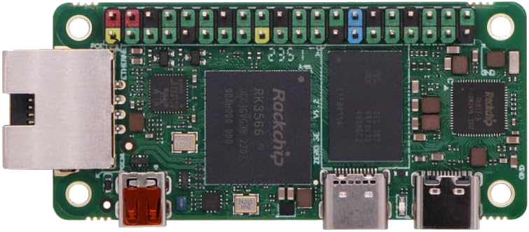

<div align="center">

# radxa-zero-3-debian

Your hardware, built in China :cn:  
Your Debian OS, assembled as open-source as possible in the USA :us:.



[](https://discord.gg/XCcQpEehej)

</div>

An easy-to-write Debian arm64 SD card image for the Radxa Zero 3E and 3W.<br>*3E only for now; 3W untested but likely functional.*

## Flash the image

Prebuilt images are available on the
[GitHub Releases page](https://github.com/Warfront1/radxa-zero-3-debian/releases).  
Download `debian-zero3e.img`, then write it to your SD card:

<details>
<summary>Windows</summary>

Use [Rufus](https://rufus.ie): pick the SD card, select `debian-zero3e.img`, hit Start.
</details>

<details>
<summary>Linux / macOS</summary>

```sh
# /dev/sdX = your SD card (use `lsblk` to find it) — not a partition (sdX1)
sudo dd if=debian-zero3e.img of=/dev/sdX bs=4M status=progress conv=fsync
```

On macOS, use `/dev/rdiskN` instead (faster) — find it with `diskutil list`.
</details>

## First boot

- Login: `root` / password: `radxa` &mdash; change immediately: `passwd`
- SSH is installed but not accessible by default (root login is key-only, no key configured)

### Expand the root filesystem

The minimal image ships undersized to keep downloads small. Expand it to fill your SD card:

```sh
# run on the booted board — /dev/mmcblk0 is the SD card (use `lsblk` to confirm)
sudo parted /dev/mmcblk0 resizepart 1 100%
sudo resize2fs /dev/mmcblk0p1
```

---

Building the image yourself? See [DEVELOPERS.md](DEVELOPERS.md).