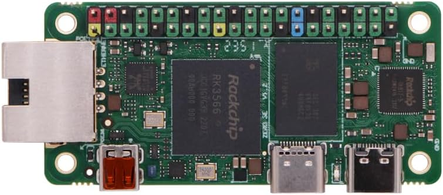

<div align="center">

# radxa-zero-3-debian

Your hardware, built in China :cn:  
Your Debian OS, assembled as open-source as possible in the USA :us:.



[](https://discord.gg/XCcQpEehej)

</div>

An easy-to-write Debian arm64 SD card image for the Radxa Zero 3E and 3W, built with mainline U-Boot and open-source TF-A BL31.<br>*3E only for now; 3W untested but likely functional.*

## Flash the image

Prebuilt images are available on the
[GitHub Releases page](https://github.com/Warfront1/radxa-zero-3-debian/releases).  
Download `debian-zero3e.img`, then write it to your SD card:

```sh
# /dev/sdX = your SD card (use `lsblk` to find it) — not a partition (sdX1)
sudo dd if=debian-zero3e.img of=/dev/sdX bs=4M status=progress conv=fsync
```

## First boot

- Login: `root` / password: `radxa` &mdash; change immediately: `passwd`
- SSH is installed but not accessible by default (root login is key-only, no key configured)

### Expand the root filesystem

The minimal image ships undersized to keep downloads small. Expand it to fill your SD card:

```sh
# use `lsblk` to find your SD card
# /dev/sdX = whole card, /dev/sdX1 = partition 1
sudo parted /dev/sdX resizepart 1 100%
sudo resize2fs /dev/sdX1
```

---

Building the image yourself? See [DEVELOPERS.md](DEVELOPERS.md).